## Teardown: Timeular Tracker
###### 06-19-2022
---
### Intro
Back in May of 2021, I was searching for ways to keep track of how my time at work was being spent. I eventually found Timeular as a potential solution.

Timeular is company which creates software and hardware for tracking your time. Timeular's flagship time-tracking software works in conjunction with the Timular Tracker to keep track of what tasks you're spending your time on. 

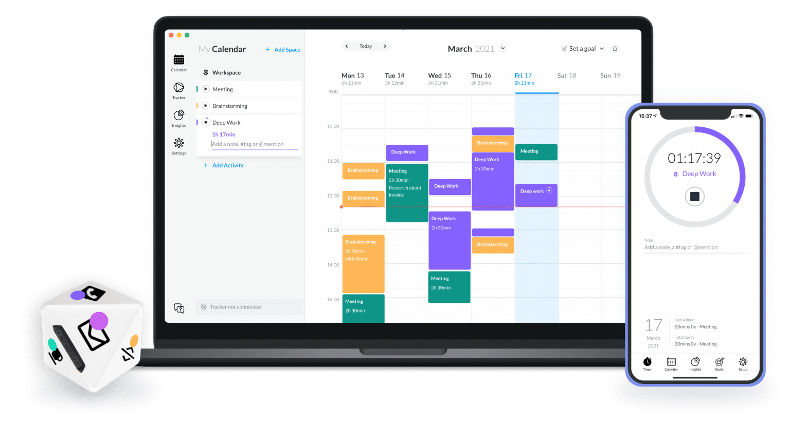

The tracker is an octahedron shaped device which is able to connect to your computer via Bluetooth. The device is also rechargeable via USB-C connector. Depending on which side you lay the device on, it can determine what you're currently working on and wirelessly communicate that to the app so it can start tracking the time spent on that task. Each side can be customized and linked to a different task in the Timeular software.

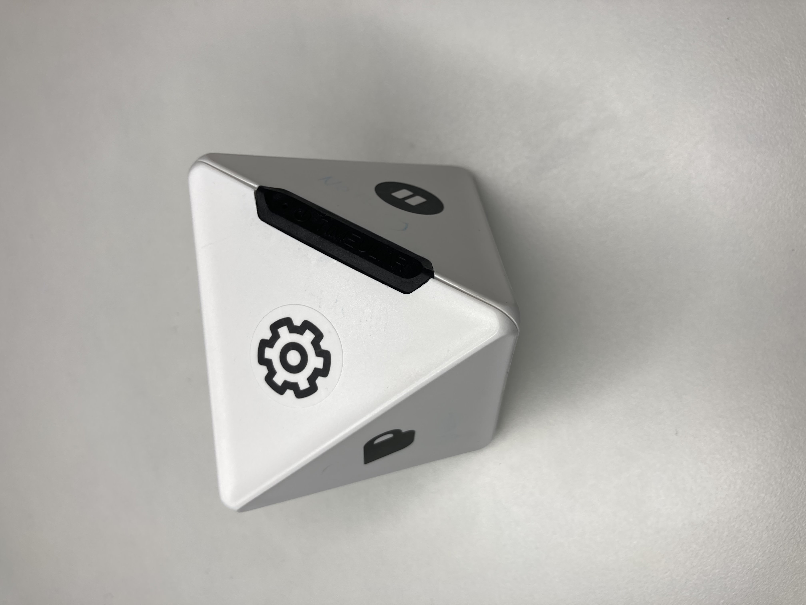

I don't use any of the Timular software or hardware anymore. I personally found micromanaging myself down to the minute to not be for me. I have instead started using the [Pomodoro technique](https://en.wikipedia.org/wiki/Pomodoro_Technique) to get stuff done.

Without further ado, let's start the teardown.

### The Outside
This is my device. When you first get the unit, it is a clean slate. The symbols on the sides are stickers I added to serve as reminders as to which side means what.

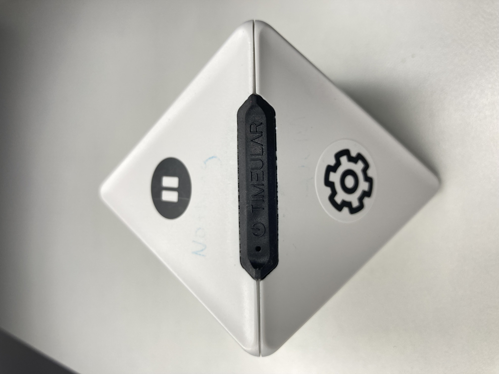

The black silicon material covers the USB-C port, LED, and a push button.

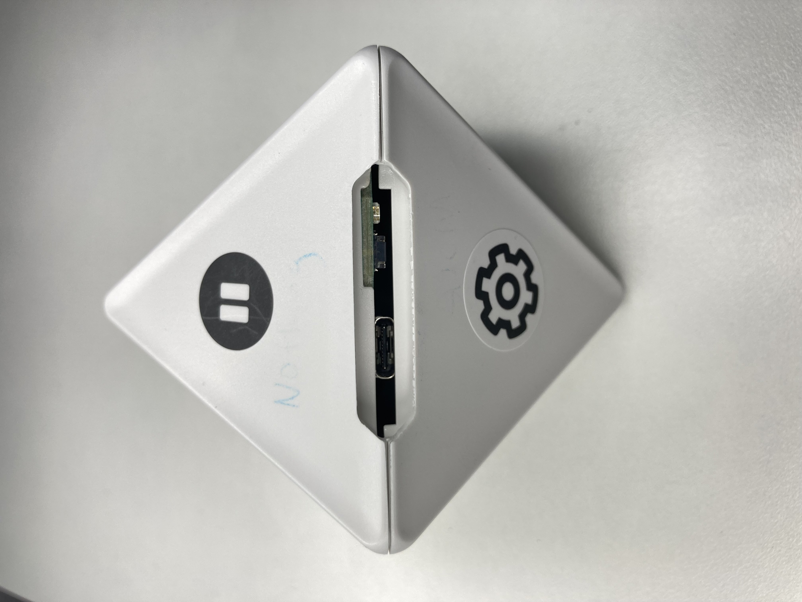

We're interested in what's inside, so lets get to the good part already!

### The Inside
After prying along the edges with a flathead, I was able to open the unit. 

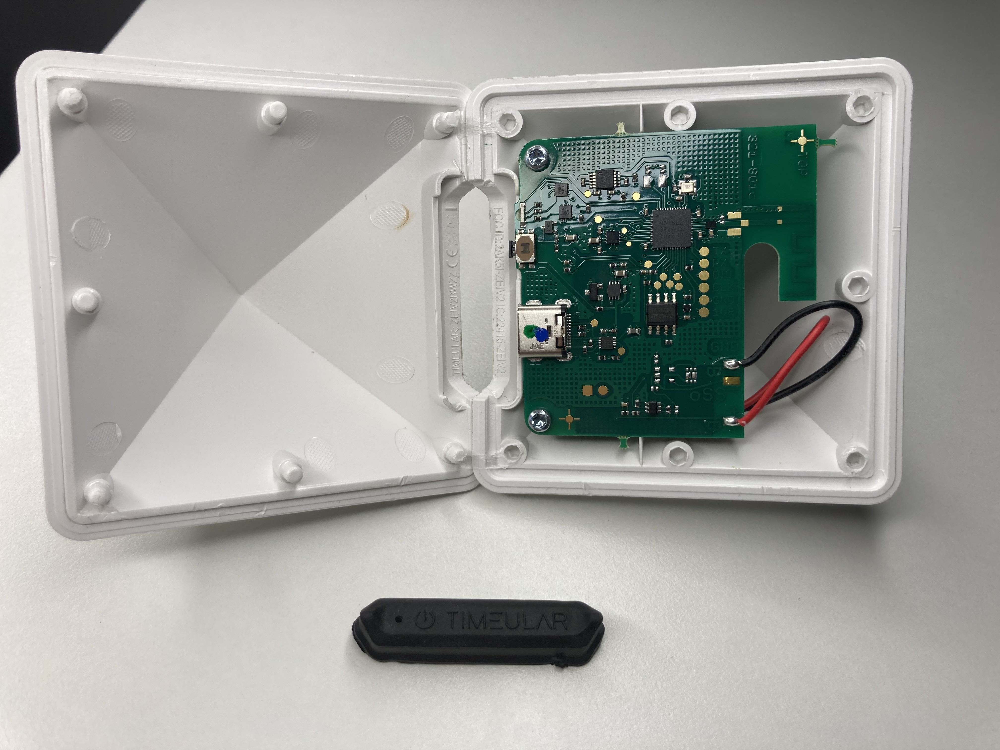

It seems it was held together by a combination of glue and 7 press-fit style studs. We can also see the PCB inside. It's being held down by two torx type screws. Whenever I see these on devices it usually signals to me that they don't want me to do what I'm doing, but that's never stopped me! Fortunately I have what feels like almost every screwdriver bit possible.

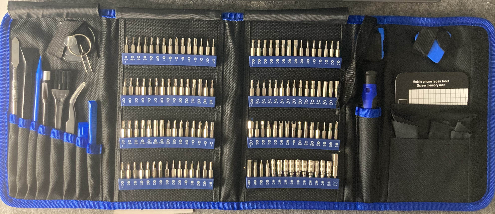

Let's take the board out and have a closer look.

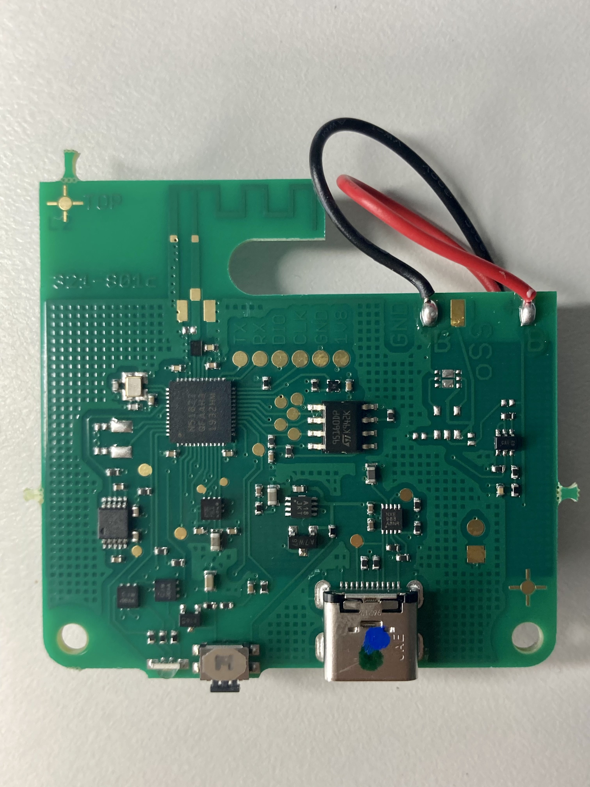

This board is 4 layers. How do I know that? The hardware designers were kind enough to leave markings for me!

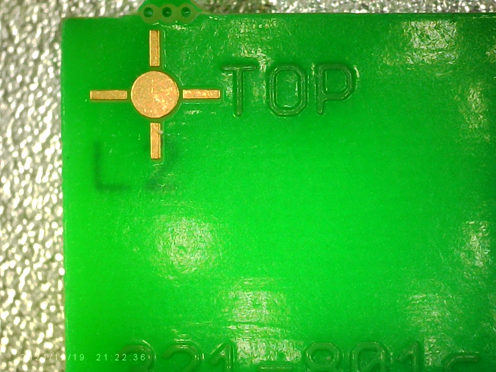
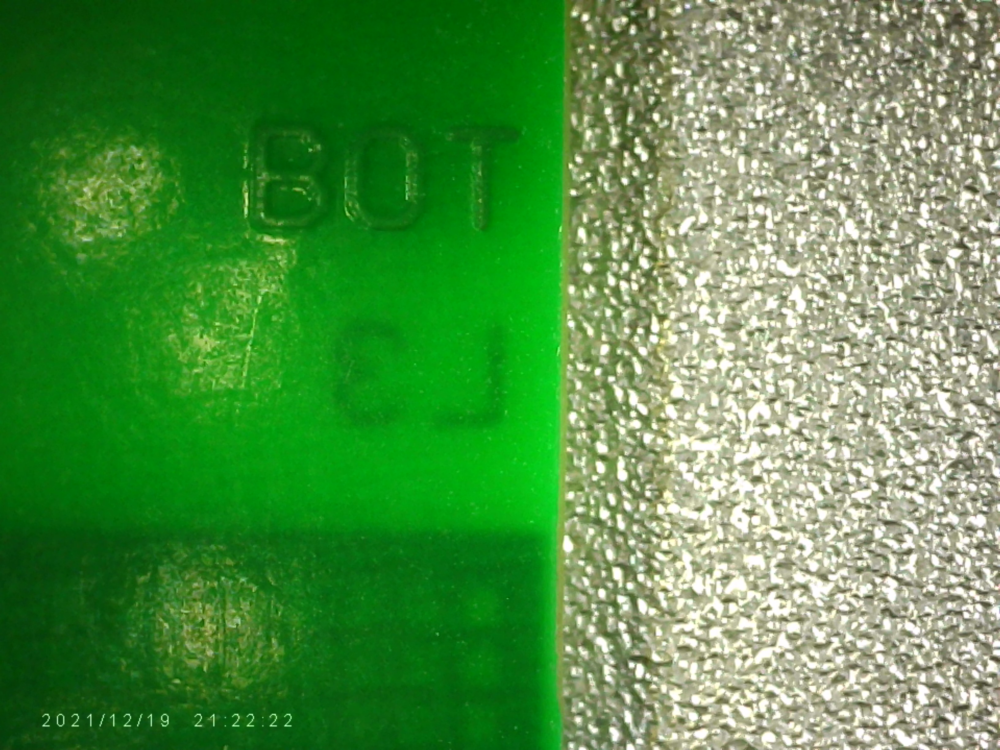
We have TOP, BOT, L2, and L3. Each of these texts are actually pieces of copper on the layer they represent. Neat! We can also see a [fiducial marker](https://www.worthingtonassembly.com/blog/2014/12/29/what-are-fiducials-and-why-are-they-useful) (shiny circle with crosshair).

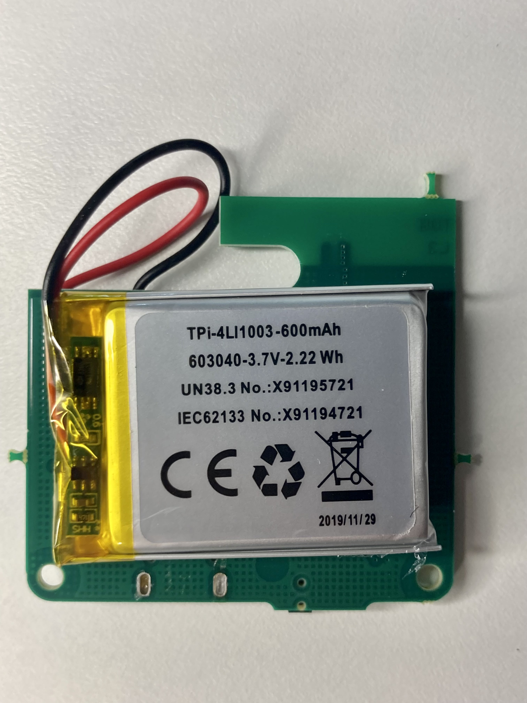

The battery on the back is a rechargeable lithium-ion battery with a capacity of 600mAh. The part number is 603040 and the output voltage is 3.7V when fully charged.

Some other things I noticed are remnants of when this board was once [part of a panel](https://resources.pcb.cadence.com/blog/what-is-pcb-panelization-and-why-is-it-important-2). 

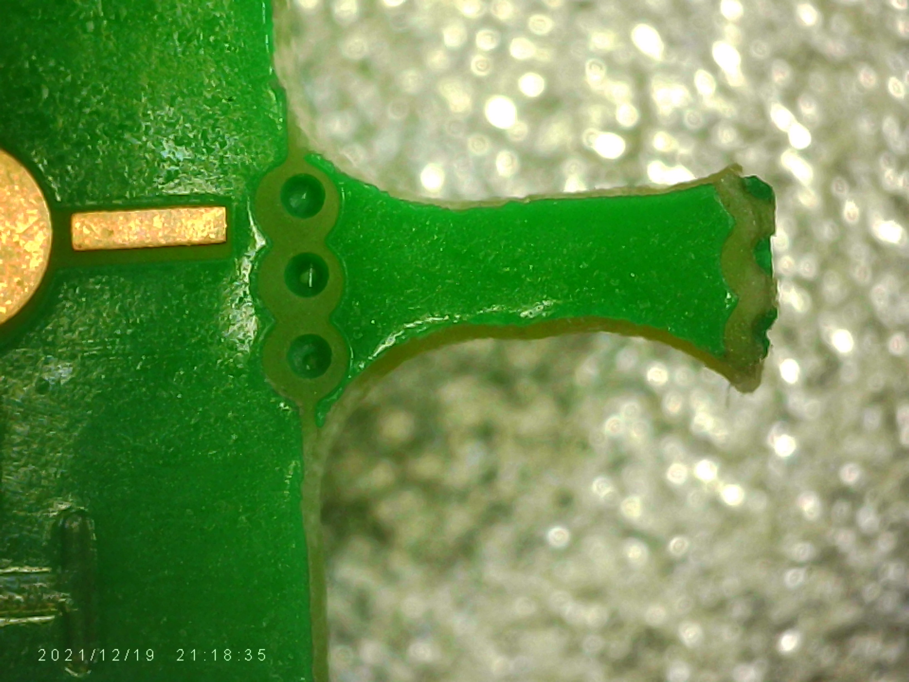

### Analysis
The top side of the PCB contains all of the surface mount components as well as the connections for the battery. Some other things that immediately stand out is that a [PCB antenna](https://www.pcbonline.com/blog/pcb-antenna-basics.html) is used for Bluetooth communication and the [hatched copper pour](https://en.wikipedia.org/wiki/Copper_pour).

I've included a table with as much info as I could find on some of the major components.

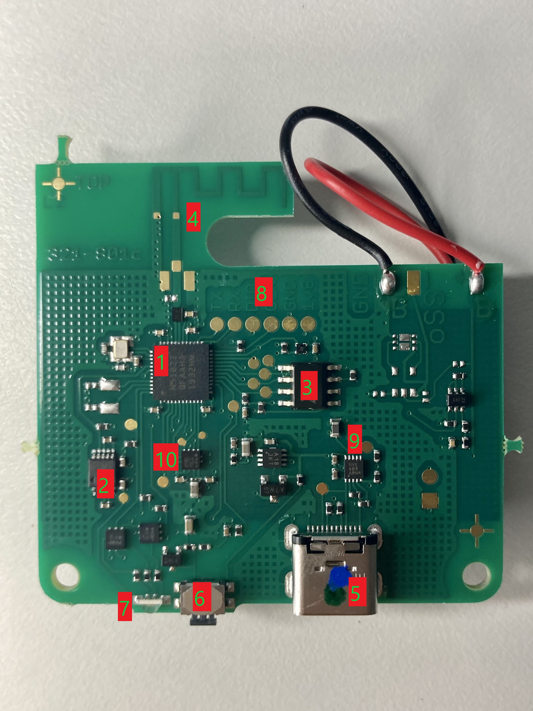

| Item | MFR P/N | Description|
|-----|--------|------|
| 1 |nRF51822|Bluetooth LE and 2.4 GHz SoC. A general purpose, low-power SoC for Bluetooth LE applications. Built around a 32-bit ARM Cortex-M0 CPU with built in flash and RAM. Includes peripherals such as Programmable Peripheral Interconnect (PPI), flexible GPIOs, SPI, TWI Master, and UART.|
|2|9BTI|Not entirely sure what this component is. It appears to be connected to one of the GPIO on the nRF51822 and one side of the right-angle LED (item no.7). If I had to take a wild guess, this chip is probably part of the circuitry for driving the LED|
|3|M95160|16-Kbit serial SPI bus EEPROM.|
|4|PCB Antenna| For wireless bluetooth communication at 2.4 GHz.|
|5|USB-C Connector|Primarily for charging the battery. I don't see any traces for D+/D- so I presumed there's communication to the main processor.|
|6|Side Mount Push Button| Used for turning the device on/off|
|7|Side Mount RGB LED|It's an RGB LED! Used to indicate things to the user.|
|8|Test Points| These pads are how the nRF51822 is programmed and debugged. We observe TX, RX, DIO, CLK, GND, and 1V8 testpoints. They chose to label the testpoints with masked copper instead of the conventional silk screen based test - boujie!|
|9|NXI 988|I'm going to assume this is a battery charger IC since I can't find any info with the part number. I'm also making this assumption because the IC is connected to the power coming in from the USB-C jack.|
|10|b2b (626?)| At first I wasn't sure what this was, but once I remembered what this device was for (time tracking by flipping the unit around on different faces) it hit me that this must be the accelerometer. This is how the unit can tell how it is oriented in space. This IC most likely communicates with the MCU via a SPI interface.|

###### Out of curiosity, I did try hooking up the TX and RX (item 8 in table) to a UART to Serial bridge converter to see if I could get into a console and maybe view some debug output, but alas, there was nothing appearing on the console. Oh well, it was worth a shot! Good job software devs! 

### Conclusion
The Timeular Tracker is a simple but well designed device. It includes only the essentials to accomplish what it does. If you're interested in purchasing a unit, you can get one [here](https://timeular.com/tracker/). Although it wasn't for me, this is a good product that I'm sure many can benefit from.

I'm glad I waited to do this teardown. Now I won't lie awake at night wondering, "what if?". 

### Extra Photos
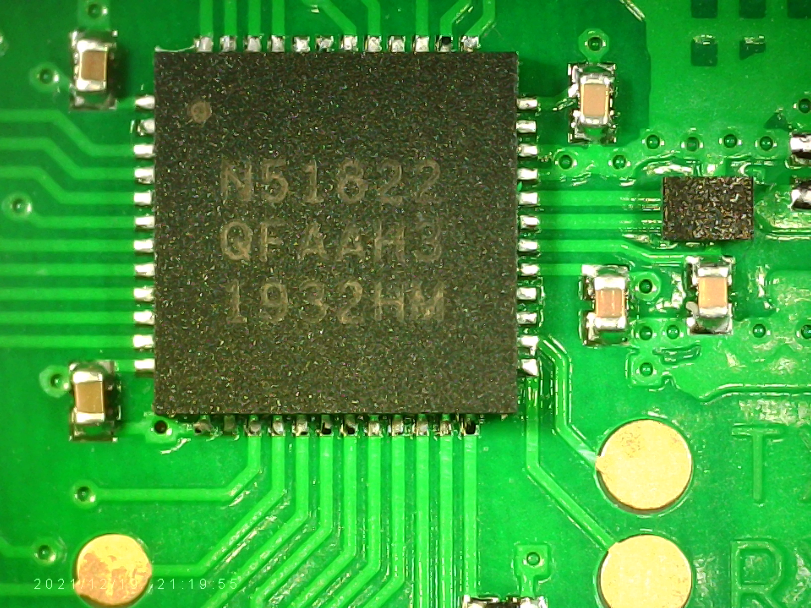
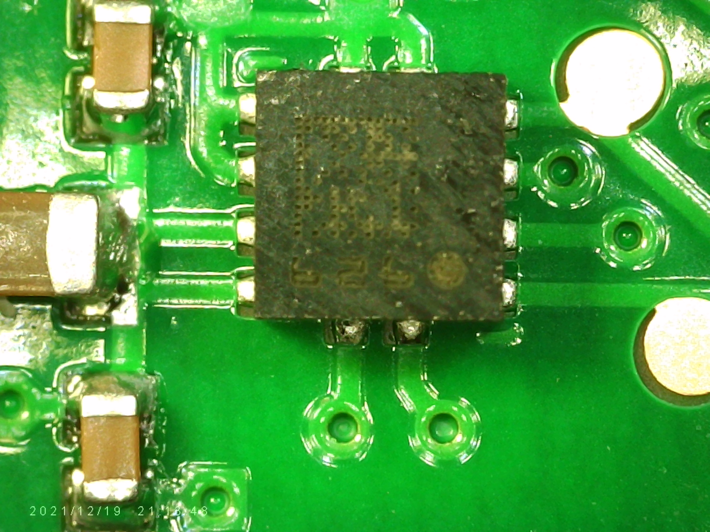
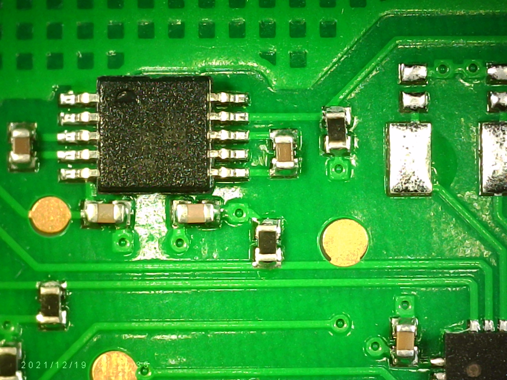
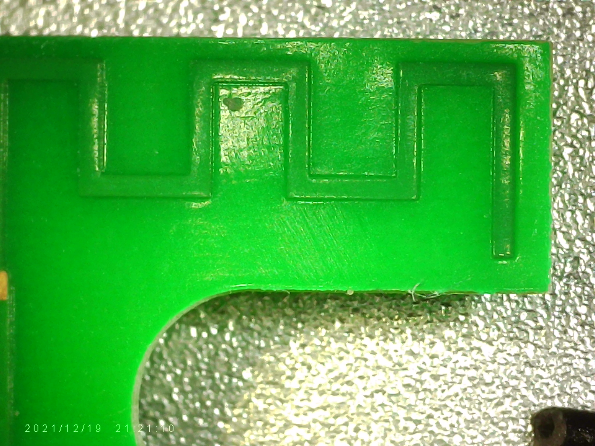
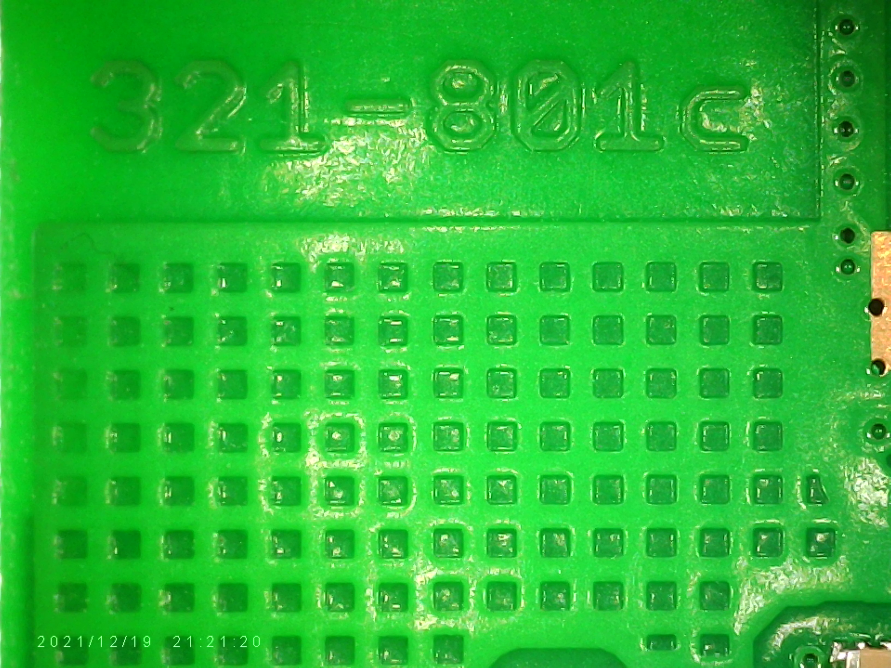
